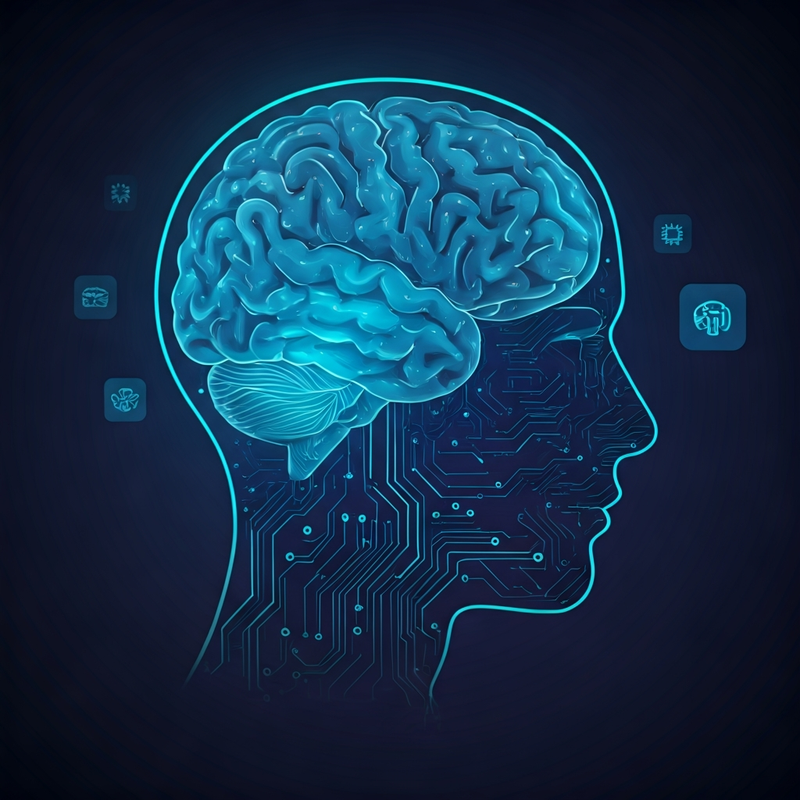
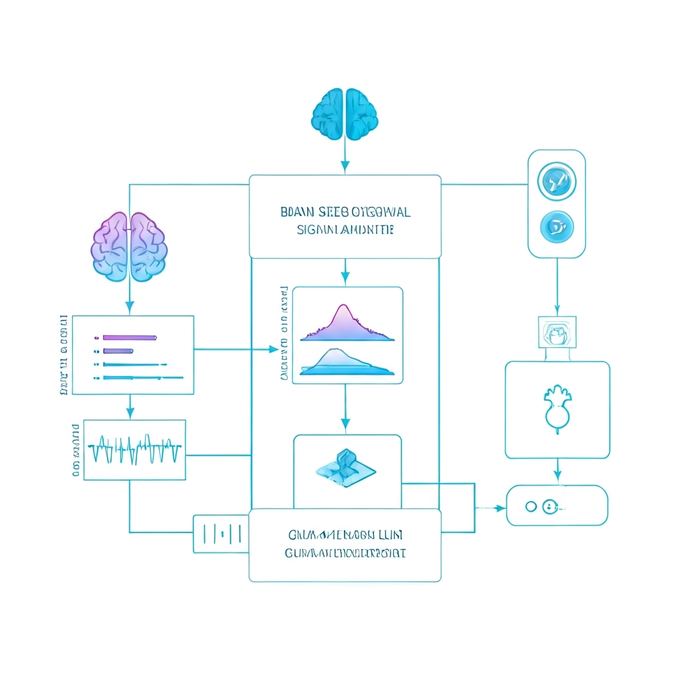
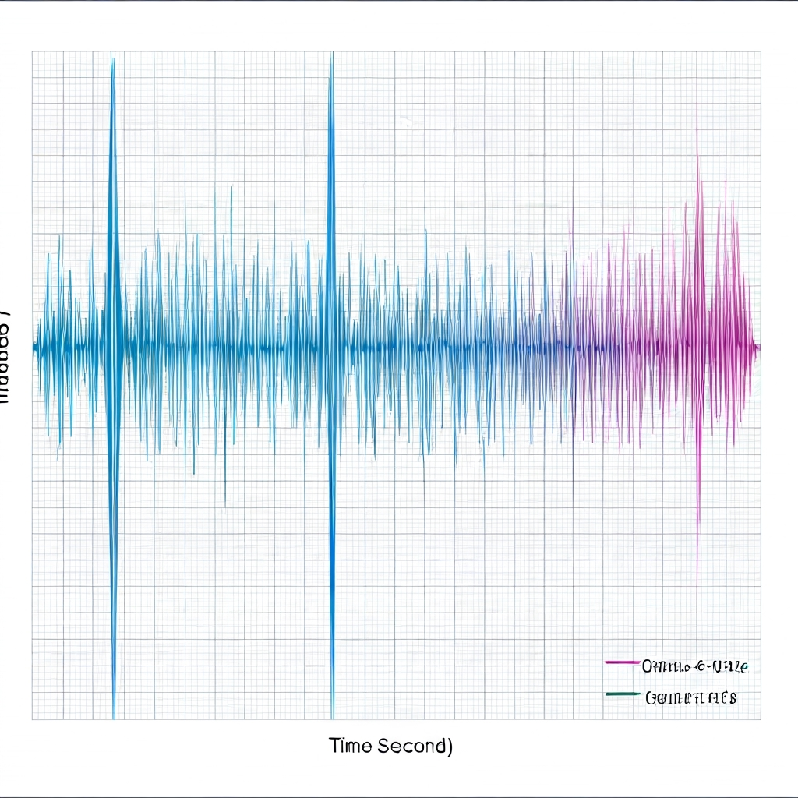

# BCI Research - 脑机接口技术调研

> 脑机接口（Brain-Computer Interface, BCI）技术全面调研项目 + 可交互 BCI Agent Demo

<p align="center">
  
</p>

---

## BCI Agent Demo

可交互的脑机接口 AI 智能体演示，支持实时合成脑电信号可视化与 AI 响应。

**在线体验**: https://bci.rxcloud.group

### 功能特性

- 实时合成 EEG 信号生成（4 通道，250Hz 采样率）
- 频带能量分析（δ/θ/α/β/γ）
- 脑状态分类（专注/放松/疲劳/指令/空闲）
- 实时波形可视化
- AI Agent 响应脑状态变化
- 响应式设计（支持移动端）

### 系统架构

<p align="center">
  
</p>

**数据流**: 合成信号生成 → 频带能量分析 → 脑状态分类 → AI Agent 响应

### 技术栈

| 层级 | 技术 |
|------|------|
| 前端 | Next.js 16 + TypeScript + TailwindCSS |
| 可视化 | ECharts |
| 信号处理 | 合成信号生成 + DFT 频带分析 |
| AI 后端 | Cloudbase 云函数 + GLM-4-Flash |
| 部署 | Vercel (前端) + Tencent Cloudbase (API) |

### 脑波信号可视化

<p align="center">
  
</p>

**支持的频带**:
- **δ (Delta)**: 0.5-4 Hz - 深睡状态
- **θ (Theta)**: 4-8 Hz - 冥想/放松
- **α (Alpha)**: 8-13 Hz - 清醒放松
- **β (Beta)**: 13-30 Hz - 专注思考
- **γ (Gamma)**: 30-45 Hz - 高级认知

### 本地运行

```bash
cd web
npm install
npm run dev

# 访问 http://localhost:3000
```

### 项目结构

```
web/
├── app/page.tsx           # 主页面
├── lib/
│   ├── signal-generator.ts  # 合成 EEG 信号生成
│   ├── band-analyzer.ts     # FFT 频带分析 + 状态分类
│   └── agent-api.ts         # AI Agent API 调用
├── hooks/
│   └── use-bci-engine.ts    # BCI 引擎 Hook
└── components/
    ├── waveform-chart.tsx   # 实时波形图
    ├── band-bars.tsx        # 频带能量条
    ├── status-cards.tsx     # 状态卡片
    ├── chat-panel.tsx       # AI 聊天面板
    └── state-switcher.tsx   # 状态切换器
```

---

## 文档结构

```
bci-research/
├── README.md                          # 项目概述（本文件）
├── docs/
│   ├── 01-fundamentals.md             # BCI 基础概念与技术分类
│   ├── 02-core-technology.md          # 核心技术栈（信号处理、算法、硬件）
│   ├── 03-companies-and-products.md   # 主要企业与产品
│   ├── 04-applications.md             # 应用场景与前沿进展
│   ├── 05-open-source-resources.md    # 开源项目与开发资源
│   ├── 06-ethics-and-regulation.md    # 伦理、法规与挑战
│   ├── 07-china-landscape.md          # 中国脑机接口产业与政策
│   ├── 08-bci-ai-fusion.md           # BCI + AI 深度融合
│   ├── 09-bci-agent-architecture.md  # 脑机接口 Agent 架构设计
│   ├── 10-sdk-selection-mindoctopus.md # MindOctopus SDK 技术选型
│   ├── 11-neuralink-tech-stack.md     # Neuralink 技术栈深度解析
│   └── superpowers/plans/             # 项目规划文档
├── web/                               # BCI Agent Demo (Next.js)
├── cloud/                             # 云函数部署
└── references/
    └── sources.md                     # 参考文献与信息源
```

## 核心发现

| 维度 | 关键数据 |
|------|----------|
| 全球临床试验 | 约 25 项 BCI 植入临床试验正在进行中 |
| 市场规模 | 预计 2034 年达 124 亿美元（CAGR ~15%）|
| 语音解码精度 | 最高达 99%，延迟 < 0.25 秒 |
| 植入患者数 | Neuralink 已为全球 12 名重度瘫痪患者植入设备 |
| 中国政策 | 七部门联合发布《脑机接口产业创新发展实施意见》|
| AI 融合 | LLM Copilot 使瘫痪患者机械臂任务从「无法完成」→ 6.5 分钟完成 |
| SDK 选型 | BrainFlow (TypeScript) + Muse 2 为 MindOctopus 最优组合 |

## 相关项目

- **MindOctopus**: 基于 BrainFlow + Muse 2 的 `channel-brainwave` 适配器（OpenOctopus 生态）

## 调研时间

2026 年 3 月 - 4 月
